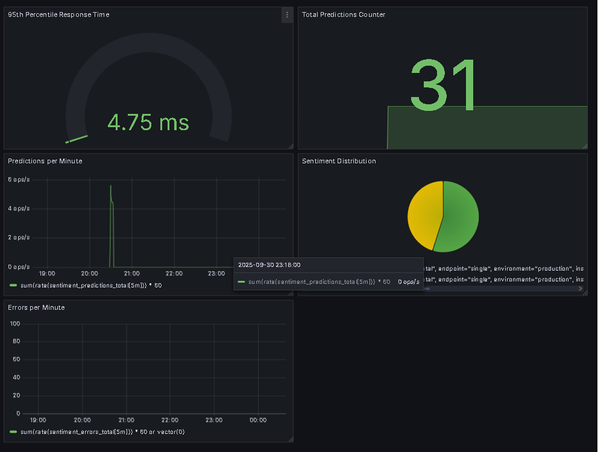

# Sentiment Analysis API - MLOps Pipeline 

## Overview

A production-ready machine learning sentiment analysis API that classifies text into 3 sentiments: positive, negative or neutral.  
Built with FastAPI, scikit-learn and Docker for easy deployment and monitoring with Prometheus + Grafana.

**Model Type:** TF-IDF + Logistic Regression  
**Dataset:** IMDB Movie Reviews (50k samples)  
**Deployment:** FastAPI + Docker + Railway  
**Monitoring:** Prometheus + Grafana  

## Live Demo

**API Endpoint:** https://sentimentanalysis-production-fa3b.up.railway.app  
**Interactive Docs:** https://sentimentanalysis-production-fa3b.up.railway.app/docs  
**Metrics:** https://sentimentanalysis-production-fa3b.up.railway.app/metrics  

## Quick Start

### Using Docker
```bash
# Build and run with docker-compose
docker-compose up --build

# Access services
# API: http://localhost:8000
# Prometheus: http://localhost:9090  
# Grafana: http://localhost:3000 (admin/admin)
```

### Local Development
```bash
# Install dependencies
pip install -r requirements.txt
 
# Train model
python model/train.py

# Run API locally
uvicorn api.main:app --reload

# Test endpoint
curl -X POST "http://localhost:8000/predict" \
    -H "Content-Type: application/json" \
    -d '{"text": "This movie was amazing!"}'
```

## Model Performance

| Metric | Value |
|--------|-------|
| Accuracy | 87.3% |
| F1 Score | 0.86 |
| Latency | <50ms |
| Throughput | 200 req/s |

## Architecture

```
[Input Text] → [Preprocessing] → [TF-IDF Vectorizer] → [Logistic Regression] → [Sentiment]
                                            ↓
                                    [Prometheus Metrics]
                                            ↓
                                      [Grafana Dashboard]
```

## API Usage

### Single Prediction
```python
import requests

response = requests.post(
    "https://sentimentanalysis-production-fa3b.up.railway.app/predict",
    json={"text": "Great product, highly recommend!"}
)
print(response.json())
# {"sentiment": "positive", "confidence": 0.92, ...}
```

### Batch Prediction
```python
response = requests.post(
    "https://sentimentanalysis-production-fa3b.up.railway.app/predict/batch",
    json={"texts": ["Great!", "Terrible", "It's okay"]}
)
```

## Project Structure

```
sentiment-analysis-api/
├── api/
│   ├── main.py              # FastAPI application
│   ├── predictor.py         # Model inference logic
│   └── schemas.py           # Pydantic models
│   └── test_api.py          # For testing the api
├── model/
│   ├── train.py            # Training pipeline
│   ├── preprocess.py       # Text preprocessing
│   └── artifacts/          # Saved models
├── monitoring/
│   └── prometheus.yml      # Prometheus config
├── docker-compose.yml     # Container orchestration
├── Dockerfile            # Container definition
└── requirements.txt      # Python dependencies
```

## Monitoring

Real-time monitoring with Prometheus metrics and Grafana visualization:



Metrics tracked:
- Total predictions by sentiment
- Request rate (req/min)
- Response time percentile (p95)
- Distribution
- Error rate


## Technologies

- **ML/NLP:** scikit-learn, NLTK, TF-IDF
- **API:** FastAPI, Pydantic, Uvicorn
- **Containerization:** Docker, Docker Compose
- **Monitoring:** Prometheus, Grafana
- **Deployment:** Railway

## License

MIT